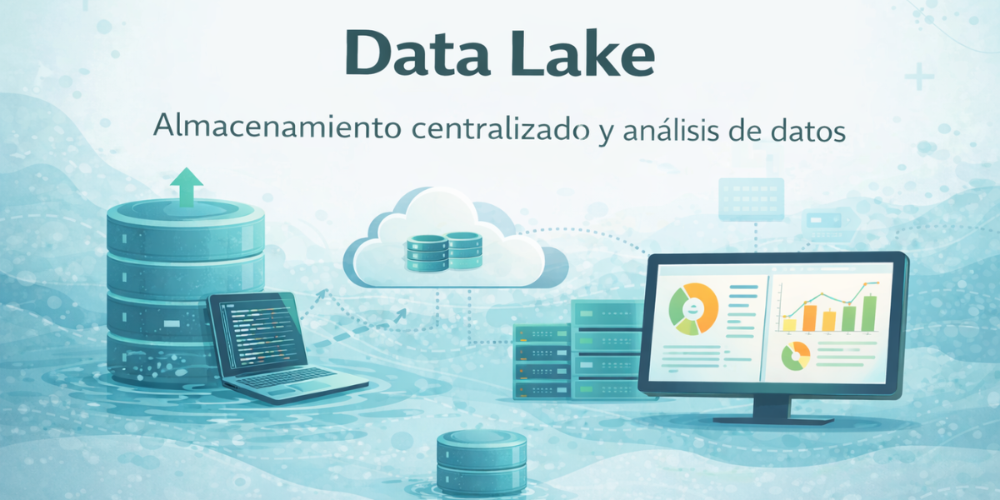

# 🧱 Data Lake & Gobierno del Dato  
### Plataforma central de datos para BI, analítica y toma de decisiones

  

## 🛠️ Tecnologías utilizadas

  
  
  
  
  

> La tecnología se utiliza como medio para construir **datos confiables, escalables y accionables**.

---

## 🎯 Objetivo del proyecto

Diseñar e implementar una **plataforma centralizada de datos (Data Lake / Lakehouse)** que permita:

- Unificar información de múltiples fuentes
- Garantizar **consistencia, calidad y gobierno del dato**
- Escalar análisis, reporting y Business Intelligence
- Reducir tareas manuales y dependencias de Excel
- Habilitar decisiones estratégicas basadas en datos confiables

El Data Lake se convierte en la **base estructural** sobre la que se apoyan todos los tableros BI, análisis territoriales y proyectos analíticos del grupo.

---

## 🧠 Rol y alcance

Proyecto desarrollado **end-to-end**, con **responsabilidad de coordinación, definición y toma de decisiones** sobre el ecosistema de datos:

- Definición de **estándares, lineamientos y prácticas de gobierno del dato**  
- Coordinación y acompañamiento de **fuentes internas y externas**, articulando con equipos técnicos, operativos y proveedores  
- Diseño y validación de **modelos semánticos para BI**, asegurando consistencia y escalabilidad de los indicadores  
- Supervisión de la **publicación, mantenimiento y evolución de tableros Power BI** conectados al Data Lake  
- Priorización de iniciativas y definición de la **hoja de ruta** para la evolución de la plataforma de datos  

👉 **Desde el diseño conceptual y estratégico hasta la operación y mejora continua del entorno de datos.**

---

## 🤝 Trabajo en equipo y colaboración

Este proyecto fue desarrollado de manera colaborativa, trabajando junto a equipos técnicos, operativos y de negocio de las distintas empresas del grupo.

Mi rol estuvo enfocado en liderar, coordinar y alinear a los distintos actores involucrados, asegurando que las decisiones técnicas respondieran a necesidades reales del negocio y que la solución evolucionara de forma sostenible.

El proceso fue acompañado en paralelo por un proveedor externo, donde **@mrivara**  desempeñó un rol clave de liderazgo y coordinación técnica, junto a su equipo.
La articulación fluida, el entendimiento del negocio y el trabajo conjunto permitieron potenciar la solución, acelerar decisiones y lograr una implementación sólida y escalable.

---

## 🔍 Problema de negocio

- Datos **dispersos** en múltiples sistemas (ERP, CRM, APIs, Excel, fuentes externas)
- Reportes inconsistentes entre áreas
- KPIs duplicados o definidos de forma distinta
- Dependencia excesiva de procesos manuales
- Dificultad para escalar BI y analítica avanzada
- Falta de trazabilidad y gobierno del dato

---

## 💡 Solución implementada

Se diseñó una arquitectura de **Data Lake / Lakehouse en Microsoft Fabric** con foco en:

- Centralización de datos
- Calidad y consistencia
- Escalabilidad
- Gobierno del dato
- Consumo eficiente desde Power BI

El Data Lake actúa como **fuente única de verdad** para todo el ecosistema analítico.

---

## 🗂️ Arquitectura de datos

### 🧱 Data Lake / Lakehouse (Microsoft Fabric)

- Ingesta de datos desde:
  - ERP
  - CRM
  - Sistemas operativos
  - APIs externas
  - Archivos históricos (Excel / CSV)
- Estructuración por capas:
  - **Raw**: datos sin transformar
  - **Curated**: datos limpios y normalizados
  - **Semantic / Analytics**: modelos listos para BI
- Normalización de entidades clave:
  - Clientes
  - Productos
  - Fechas
  - Zonas / territorios
- Escalabilidad para nuevas fuentes y proyectos

📊 **Actualmente: +220 tablas activas** en el Data Lake.

---

## 🔗 Integraciones

- **APIs externas**
- Banco Nación Argentina: tipo de cambio y referencias financieras
- Bolsa de Cereales: precios, referencias productivas y variables de mercado
- John Deere APIs: Operation Center, Expert Connect y datos operativos de maquinaria
- APIs de sistemas operativos: AllTrack, ArcGIS y plataformas de monitoreo
- **Sistemas internos:**
  - ERP
  - CRM
  - Sistemas comerciales y operativos
- **Fuentes históricas migradas desde Excel**

---

## 📊 Business Intelligence & Modelado Semántico

- Diseño y publicación de **tableros Power BI conectados directamente al Data Lake**
- Uso de **modelos semánticos** para:
  - Garantizar consistencia de KPIs
  - Evitar duplicación de lógica
  - Facilitar escalabilidad
- Definición de medidas y métricas reutilizables
- Separación clara entre:
  - Capa de datos
  - Capa semántica
  - Capa de visualización

Esto permite que distintos tableros consuman **la misma lógica de negocio**, sin inconsistencias.

---

## 🛡️ Gobierno del dato (pilar clave)

Se implementaron prácticas de **Data Governance** orientadas al negocio:

- Definición y documentación de:
  - KPIs
  - Métricas
  - Reglas de negocio
- Estandarización de nombres, campos y estructuras
- Controles de calidad:
  - Validaciones
  - Consistencia entre fuentes
  - Detección de anomalías
- Trazabilidad del dato:
  - Origen
  - Transformaciones
  - Uso en BI
- Alineación entre áreas para una **interpretación única del dato**

El objetivo: **confianza en los datos y decisiones sin discusión sobre “qué número es el correcto”.**

---

## ⚙️ Automatización

- Automatización de:
  - Ingesta de datos
  - Procesos ETL / ELT
  - Actualización de modelos
  - Refresh de tableros BI
- Reducción drástica de tareas manuales
- Mejora en tiempos de actualización y disponibilidad de información

---

## 📈 Impacto logrado

- Fuente única de datos para todo el grupo
- Reportes más rápidos, consistentes y confiables
- Mayor autonomía de las áreas de negocio
- Base sólida para:
  - BI
  - Análisis territorial
  - Proyectos de biopotencial
  - Automatización y analítica futura
- Escalabilidad real del ecosistema de datos

---

## 📌 Estado del proyecto

✅ Implementado  
🔄 En evolución continua (nuevas fuentes, métricas y mejoras de gobierno del dato)

  
    🤝 Los mejores resultados nacen del trabajo en equipo. 
    <em>The best results are built through teamwork.</em>
  

