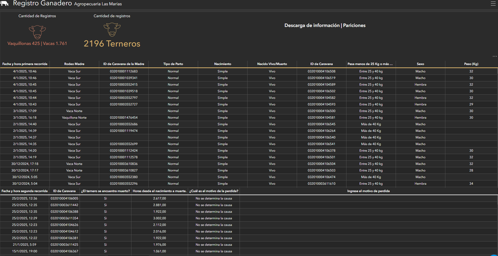

# 🐄 Feedlot  
### Seguimiento de pariciones y registro ganadero en tiempo real

  

---

## 🛠️ Tecnologías

  
  
  

  <em>La tecnología se utiliza como medio para mejorar la gestión productiva y la toma de decisiones a campo.</em>

---

## 🎯 Objetivo

Digitalizar y optimizar el **registro de pariciones en feedlot**, reemplazando el uso de planillas en papel por una **solución digital integral**, que permita:

- Registrar nacimientos en **tiempo real**
- Reducir la pérdida de información
- Mejorar la trazabilidad y calidad de los datos
- Facilitar el análisis productivo y sanitario
- Acompañar la toma de decisiones operativas

---

## 🧠 Rol y alcance

Proyecto desarrollado **end-to-end**, con responsabilidad total sobre:

- Relevamiento del proceso productivo a campo  
- Diseño de la solución digital  
- Construcción de formularios móviles (offline / online)  
- Implementación en dispositivos móviles de los colaboradores  
- Edición y gestión web de la información  
- Construcción de tableros de seguimiento  
- Acompañamiento durante campañas productivas  

👉 **Desde la idea inicial hasta la implementación y seguimiento en campo.**

---

## 🔍 Problema

Antes de esta solución:

- El registro de pariciones se realizaba **en papel**
- Existía **pérdida de datos** y registros incompletos
- No había trazabilidad histórica confiable
- El análisis productivo era limitado y tardío
- No se contaba con información en tiempo real

Esto impactaba directamente en la **calidad de la información**, el control productivo y la toma de decisiones.

---

## 💡 Solución implementada

Se diseñó una solución integral basada en:

- **Formularios digitales (Survey)**:
  - Carga de datos **offline y online**
  - Uso desde el celular de cada colaborador
- **Edición y gestión web**:
  - Corrección y actualización de datos
  - Acceso centralizado a la información
- **Registro en tiempo real**:
  - Nacimientos
  - Peso
  - Sexo
  - Tipo de parto
  - Estado (vivo / muerto)
- **Tableros de seguimiento** para análisis productivo

Actualmente, el sistema se encuentra en su **segunda campaña productiva**, consolidando la adopción y el uso operativo.

---

## 📊 Análisis y valor generado

Los tableros permiten analizar:

- Cantidad de vientres paridos
- Terneros nacidos (vivos y muertos)
- Peso promedio al nacimiento
- Tipo de nacimiento (simple / múltiple)
- Tipo de parto (normal / distócico)
- Mortalidad al nacer y post nacimiento
- Evolución por campaña

Toda la información se encuentra **centralizada, actualizada y trazable**.

---

## 🚜 Uso a campo 

- Cada colaborador registra los datos desde su **celular**
- Funciona **sin conexión** y sincroniza automáticamente
- Permite edición tanto desde **web como móvil**
- Reduce errores manuales
- Aumenta la confiabilidad del dato

La solución se adapta al **ritmo real del trabajo a campo**.

---

## 📈 Impacto

- Eliminación del registro en papel
- Mejora significativa en la calidad del dato
- Información disponible en tiempo real
- Mayor control productivo y sanitario
- Seguimiento histórico por campaña
- Base sólida para análisis futuros

---

## 📸 Capturas del proyecto

### Registro de pariciones

### Seguimiento productivo

---

## 📌 Estado del proyecto

✅ Implementado  
🔄 En uso activo (segunda campaña productiva)
