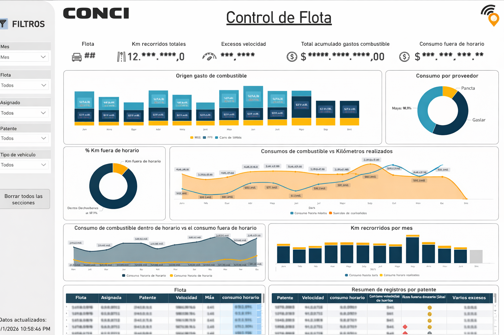

# ⛽ Control de Combustible y Flota  
### Business Intelligence Operativo para la gestión integral de vehículos

  

---

## 🛠️ Tecnologías

  
  
  
  
  

> La tecnología se utiliza como medio para resolver problemas reales de gestión y control operativo.

---

## 🎯 Objetivo

Implementar una **visión integral y centralizada del consumo de combustible y uso de flota**, permitiendo responder preguntas clave:

> **¿Cómo se utiliza la flota?, ¿Dónde se gasta?, ¿Cuándo se consume fuera de horario?, ¿Qué desvíos existen y dónde actuar?**

El proyecto busca **optimizar costos**, mejorar el control operativo y definir **políticas de uso y mantenimiento preventivo**.

---

## 🧠 Rol y alcance

Proyecto desarrollado de forma **colaborativa**, con un rol activo en la **coordinación, definición y toma de decisiones** a lo largo de todo el ciclo del producto.

- Ideación y discovery
- Definición de **KPIs, reglas de negocio y criterios de análisis**  
- Coordinación de la **integración de múltiples fuentes de datos** (a cargo de Agus Spalla) 
- Acompañamiento en el **diseño del modelo analítico**
- Desarrollo y validación de **tableros de Business Intelligence**  
- Iteración continua entre **primera y segunda versión** del producto, incorporando feedback del negocio

---

## 🔍 Problema

Antes del proyecto:

- ❌ No existía supervisión centralizada de la flota  
- ❌ Consumos sin control ni trazabilidad  
- ❌ Uso fuera de horario no identificado  
- ❌ Mantenimiento reactivo y no preventivo  
- ❌ Datos dispersos en Excel y sistemas externos  

La flota abarca **las 4 empresas del Grupo CONCI**, lo que amplificaba el problema.

---

## 💡 Solución

Se desarrolló una solución integral de **Control de Flota y Combustible**, basada en:

- Consolidación de datos en un **Data Lake unificado**
- Integración de **APIs externas** (Alltrack)
- Migración y normalización de **Excel históricos** de dos proveedores de combustible
- Modelos analíticos orientados a **control, prevención y acción**
- Tableros operativos de lectura rápida para responsables y gerencia

El resultado: **control real, visibilidad total y capacidad de acción inmediata**.

---

## 🗂️ Arquitectura y datos

### 🔗 Integraciones
- API de **Alltrack** (seguimiento y eventos de flota)
- Excel históricos de compañías de combustible
- Fuentes internas administrativas y operativas

### 🧱 Data Lake
- Normalización de patentes, flotas y asignaciones
- Unificación de consumos y kilómetros
- Calendario fiscal y temporal
- Capas reutilizables para análisis futuro
- Control de calidad y consistencia de datos

---

## 📊 Análisis y visualización

Los tableros permiten analizar:

- 🚗 Cantidad de vehículos por flota
- ⛽ Consumo total y acumulado de combustible
- 📏 Kilómetros recorridos
- 🕒 Consumo **dentro y fuera de horario**
- ⚠️ Excesos de velocidad
- 🧾 Consumo por proveedor
- 📅 Evolución mensual de consumo y kilómetros
- 🔍 Detalle por patente con alertas visuales

---

## 🚦 Valor diferencial

- Identificación temprana de desvíos
- Reducción del consumo innecesario
- Organización de salidas y recorridos
- Soporte a **mantenimiento preventivo**
- Base objetiva para definir una **nueva política de uso de flota**
- Información clara para toma de decisiones operativas y gerenciales

---

## 📈 Impacto logrado

- 📉 Reducción del consumo de combustible  
- 📊 Mayor control y trazabilidad  
- 🛠️ Mejora en planificación de mantenimiento  
- 🚦 Detección de usos indebidos  
- ⏱️ Menos análisis manual, más acción  

---

## 📸 Capturas del proyecto

### 📊 Vista general – Control de flota

### 🧱 Modelo de datos

---

## 📌 Estado del proyecto

✅ Implementado  
🔄 Segunda versión en producción con mejoras continuas
