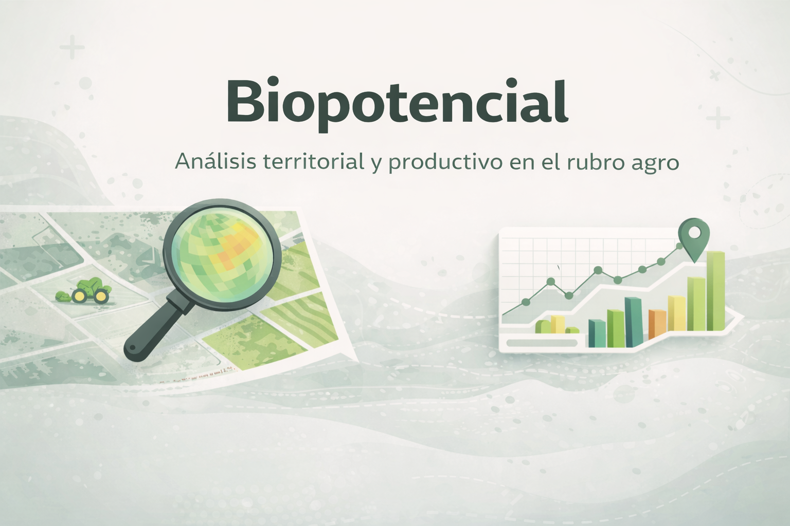
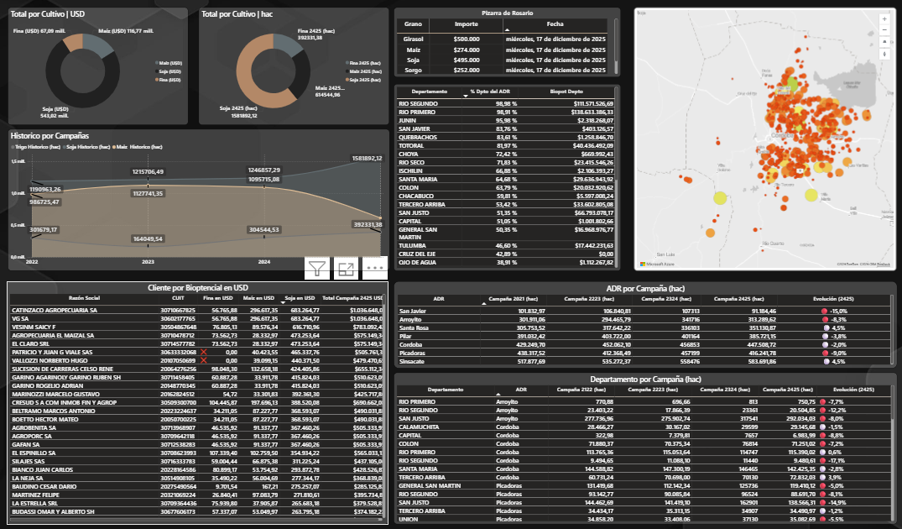

# 🌱 Biopotencial  
### Análisis integral de clientes, territorio y facturación en el rubro agro

  

---

## 🛠️ Tecnologías

  
  
  
  

  <em>La tecnología se utiliza como medio para resolver problemas de negocio.</em>

---

## 🎯 Objetivo

Construir una **visión 360° del cliente**, integrando información **productiva, territorial, comercial y financiera**, para responder una pregunta clave:

> **¿Cuál es el biopotencial real de cada cliente y cómo se relaciona con su facturación actual?**

El proyecto permite **priorizar acciones comerciales**, detectar oportunidades y analizar el negocio por **cliente, zona y área**.

---

## 🧠 Rol y alcance

Proyecto desarrollado **end-to-end**, con responsabilidad total sobre:

- Ideación y discovery con áreas comerciales y operativas  
- Diseño del modelo de datos y arquitectura  
- Integraciones, automatización y Data Lake  
- Construcción de KPIs, tableros y acciones sugeridas  

👉 **Desde la idea hasta la implementación final.**

---

## 🔍 Problema

- Información de clientes **fragmentada**  
- Falta de visibilidad del **potencial productivo real**  
- Decisiones basadas solo en facturación histórica  
- Dificultad para priorizar clientes, zonas y áreas  

---

## 💡 Solución

Se diseñó una solución integral basada en:

- **Data Lake** como fuente única de información  
- Integración de **APIs externas** (BNA, Bolsa de Cereales)  
- Modelos de **biopotencial vs facturación**  
- Análisis territorial aplicado al rubro agro  
- Tableros orientados a **acción comercial rápida**

El resultado es una visión que permite entender **no solo lo que el cliente compra, sino lo que podría comprar**.

---

## 📊 Análisis y valor generado

Los tableros permiten analizar:

- Biopotencial total y por cliente  
- Biopotencial vs **Facturación FY**  
- Segmentación por nivel de aprovechamiento  
- Clientes con alto potencial **no conectados**  
- Avance por **zona, sucursal y área**  

---

## 🚦 Acciones sugeridas

Se incorporó una lógica de **acciones automáticas** para uso comercial:

- 🟢 Cliente activo y bien aprovechado  
- 🟡 Cliente con potencial medio  
- 🔴 Cliente con bajo aprovechamiento  
- 💤 Cliente dormido  
- ⚠️ Cliente con alto biopotencial no conectado  

Esto permitió **pasar del análisis a la acción** y facilitar el trabajo diario de los equipos comerciales.

---

## 📈 Impacto

- Mejor priorización comercial  
- Mayor foco en clientes con alto potencial  
- Visión integrada del negocio  
- Reducción del análisis manual  
- Decisiones más rápidas y accionables  

---

## 📸 Capturas del proyecto

### Segmentación de clientes y biopotencial

### Biopotencial vs Facturación

### Acciones sugeridas

### Modelo de datos

---

## 📌 Estado del proyecto

✅ Implementado  
🔄 En evolución según feedback del negocio
